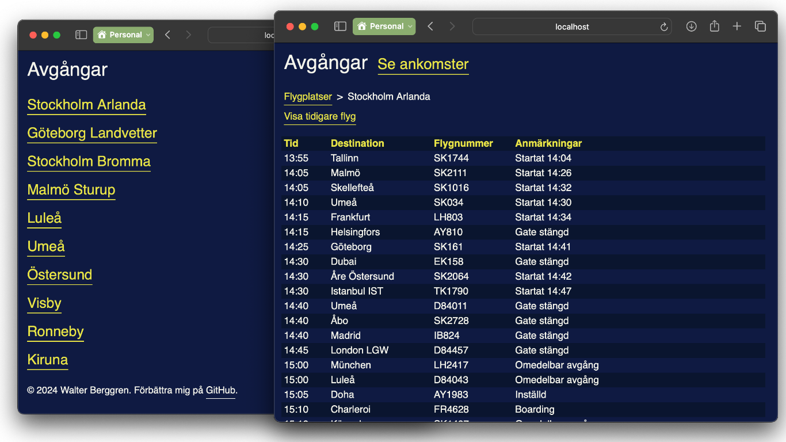

# Ankomster.nu

Arrival and departure times for Swedavia's airports in Sweden.
Designed to mimic the look and feel of the physical arrival and departure boards at the airports.
It also loads blazingly fast on slow in-flight Wi-Fi, thanks to the use of server-side rendering with minimal dependencies.

[ankomster.nu](https://ankomster.nu)

## Features

- Arrival and departure times for today's and tomorrow's flights
- Automatic updates every 30 seconds
- 29 KB page size, out of which 21 KB is deferred optional [HTMX](https://htmx.org) (I had to try some new tech)

## Development

1. Request a [Swedavia API key](https://apideveloper.swedavia.se)
2. Clone the repository
3. Install dependencies with `npm install`
4. Start the development server with `SWEDAVIA_API_KEY=key-here npm run start:dev`
5. Open [http://localhost:8080](http://localhost:8080) in your browser
